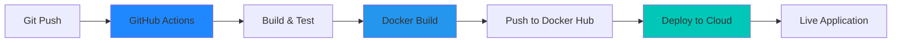

# Spring Boot CI/CD Docker Application


A production-ready Spring Boot application demonstrating modern DevOps practices: automated CI/CD pipeline, containerization, and cloud deployment.

---

## 🎯 What This Project Demonstrates

✅ **Backend Development** - RESTful API with Spring Boot  
✅ **Containerization** - Docker multi-stage builds  
✅ **CI/CD Automation** - GitHub Actions pipeline  
✅ **Cloud Deployment** - Automated deployment to cloud platforms  
✅ **DevOps Best Practices** - Complete software delivery lifecycle  

---

## 🏗️ Architecture



**Workflow:**
1. Developer pushes code to GitHub
2. GitHub Actions automatically triggers
3. Maven builds and tests the application
4. Docker image is created and pushed to Docker Hub
5. Cloud platform deploys the new version
6. Application is live and accessible

---

## 🛠️ Technology Stack

| Component | Technology |
|-----------|-----------|
| **Language** | Java 17 |
| **Framework** | Spring Boot 3.1.6 |
| **Build Tool** | Maven |
| **Containerization** | Docker |
| **CI/CD** | GitHub Actions |
| **Testing** | JUnit 5 |
| **Cloud** | Railway |

---

## 🚀 API Endpoints

### `GET /health`
Health check endpoint for monitoring.

**Response:**
```json
{
  "status": "UP",
  "timestamp": 1703856234567
}
```

### `GET /config`
Configuration endpoint demonstrating environment variable injection.

**Response:**
```json
{
  "message": "Hello from Spring Boot",
  "envVarPresent": true
}
```

---

## 🔄 CI/CD Pipeline

The GitHub Actions pipeline automatically:

1. **Build & Test** - Compiles code and runs tests
2. **Docker Build** - Creates optimized container image
3. **Push to Registry** - Uploads to Docker Hub
4. **Deploy** - Triggers cloud deployment

### Pipeline Features:
- ✅ Automated testing on every commit
- ✅ Multi-stage Docker builds for optimization
- ✅ Automatic deployment on main branch
- ✅ Build caching for faster pipelines

---

## 💻 Quick Start

### Run Locally with Maven
```bash
# Clone the repository
git clone <repository-url>
cd CICD-Docker

# Run the application
mvn spring-boot:run

# Test endpoints
curl http://localhost:8080/health
curl http://localhost:8080/config
```

### Run with Docker
```bash
# Build Docker image
docker build -t cicd-docker:latest .

# Run container
docker run -p 8080:8080 cicd-docker:latest

# Test
curl http://localhost:8080/health
```

---

## 📁 Project Structure

```
CICD-Docker/
├── .github/workflows/
│   └── ci-cd.yml              # CI/CD pipeline configuration
├── src/
│   ├── main/java/             # Application source code
│   │   └── controller/        # REST API controllers
│   └── test/java/             # Unit and integration tests
├── Dockerfile                 # Multi-stage Docker build
├── pom.xml                    # Maven dependencies
└── README.md
```

---

## 🐳 Docker Implementation

**Multi-stage build** for optimized images:
- **Stage 1:** Build with Maven (includes all build tools)
- **Stage 2:** Runtime with minimal JRE (smaller, more secure)

**Benefits:**
- Reduced image size
- Faster deployments
- Better security (no build tools in production)

---

## ☁️ Cloud Deployment

### Setup Steps:
1. **Docker Hub:** Push images to registry
2. **Cloud Platform:** Configure service (Render/Railway)
3. **GitHub Secrets:** Add credentials for automation
4. **Deploy Hook:** Enable automatic deployments

### Required GitHub Secrets:
- `DOCKERHUB_USERNAME` - Docker Hub username
- `DOCKERHUB_TOKEN` - Docker Hub access token
- `RAILWAY_TOKEN` - Railway deployment token (optional)

---

## 🎓 Key Skills Demonstrated

### Backend Development
- RESTful API design with Spring Boot
- Dependency injection and configuration management
- Unit and integration testing

### DevOps & CI/CD
- GitHub Actions workflow automation
- Docker containerization and multi-stage builds
- Automated testing and deployment pipelines

### Cloud & Infrastructure
- Container orchestration
- Environment-based configuration
- Cloud platform deployment (PaaS)

### Software Engineering
- Version control with Git
- Automated testing practices
- Production-ready application design

---

## 🧪 Testing

```bash
# Run all tests
mvn test

# Build and package
mvn clean package

# Skip tests (for quick builds)
mvn package -DskipTests
```

**Test Coverage:**
- Unit tests for REST controllers
- Integration tests for application context
- Automated testing in CI pipeline

---

## 🔧 Configuration

Environment variables for runtime configuration:

| Variable | Description | Default |
|----------|-------------|---------|
| `APP_MESSAGE` | Custom message for `/config` endpoint | `Hello from Spring Boot` |
| `PORT` | Server port | `8080` |
| `JAVA_OPTS` | JVM options | `-Xms256m -Xmx512m` |

---

## 📝 License

MIT License - Free to use and modify.

---

## 🌟 Project Highlights

This project showcases a **complete DevOps workflow** from development to production:

- **Automated CI/CD** reduces manual deployment effort
- **Containerization** ensures consistency across environments
- **Cloud deployment** demonstrates modern infrastructure practices
- **Production-ready** code with proper testing and configuration

**Perfect demonstration of modern software engineering practices for portfolio and interviews.**
