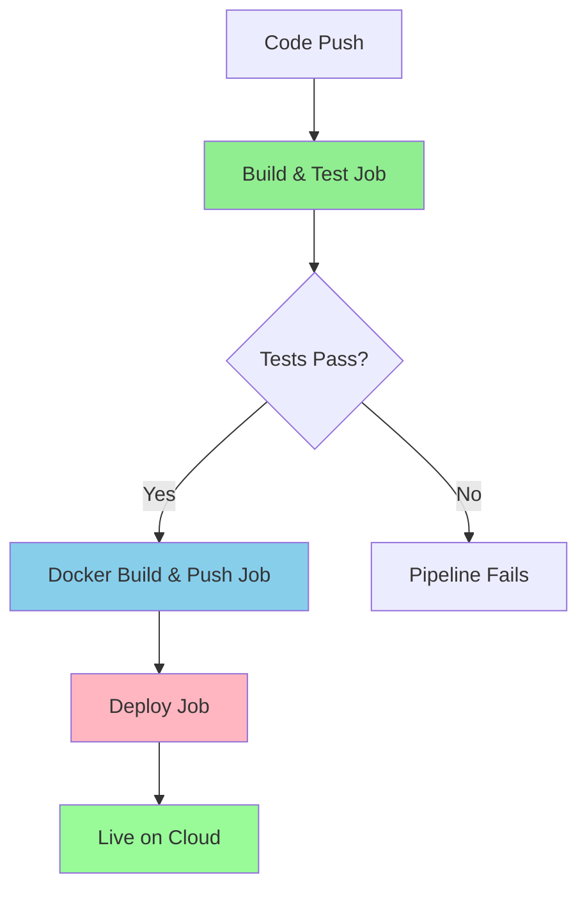

# CI/CD-Enabled Spring Boot Application with Dockerized Cloud Deployment


A production-ready demonstration of modern software delivery practices, showcasing how a Java Spring Boot backend application is built, containerized, automated, and deployed using CI/CD pipelines.

---

## 📑 Table of Contents

- [🎯 Project Purpose](#-project-purpose)
- [🏗️ Architecture Overview](#️-architecture-overview)
- [🚀 What the Application Does](#-what-the-application-does)
- [🛠️ Technology Stack](#️-technology-stack)
- [💻 Local Development](#-local-development)
  - [Prerequisites](#prerequisites)
  - [Running Locally](#running-locally)
  - [Testing Endpoints](#testing-endpoints)
  - [Running Tests](#running-tests)
- [🐳 Docker](#-docker)
  - [Building the Docker Image](#building-the-docker-image)
  - [Running the Container](#running-the-container)
  - [Testing the Dockerized Application](#testing-the-dockerized-application)
- [🔄 CI/CD Pipeline](#-cicd-pipeline)
  - [Pipeline Stages](#pipeline-stages)
  - [Job Details](#job-details)
  - [Required GitHub Secrets](#required-github-secrets)
- [☁️ Cloud Deployment](#️-cloud-deployment)
  - [Deploying to Render](#deploying-to-render)
  - [Alternative Platforms](#alternative-platforms)
- [🔧 Configuration](#-configuration)
- [🧪 Testing](#-testing)
- [📁 Project Structure](#-project-structure)
- [🐛 Troubleshooting](#-troubleshooting)
- [🎓 Learning Outcomes](#-learning-outcomes)
- [📝 License](#-license)
- [🤝 Contributing](#-contributing)
- [📧 Contact](#-contact)
- [🌟 Acknowledgments](#-acknowledgments)

---

## 🎯 Project Purpose

This project demonstrates **real-world software delivery maturity** — not just application development, but how code moves from a developer's machine to a live production environment in a controlled, repeatable, and automated manner.

### What This Project Proves

✅ **Production-Ready Workflows** - Understanding of how applications are prepared for production  
✅ **Automation Expertise** - Ability to automate builds, tests, and deployments  
✅ **Container Proficiency** - Working knowledge of Docker and containerization  
✅ **CI/CD Implementation** - Hands-on experience with GitHub Actions pipelines  
✅ **Cloud Deployment** - Configuration management across development and production environments  

This project mirrors how backend services are deployed in professional engineering teams.

---

## 🏗️ Architecture Overview

```mermaid
graph LR
    A[Developer] -->|git push| B[GitHub Repository]
    B -->|Trigger| C[GitHub Actions]
    C -->|Build & Test| D[Maven Build]
    D -->|Package| E[Docker Image]
    E -->|Push| F[Docker Hub]
    F -->|Deploy| G[Cloud Platform]
    G -->|Serve| H[Public URL]
    
    style C fill:#2088FF
    style E fill:#2496ED
    style G fill:#00C7B7
```



### Deployment Flow

1. **Source Control** - Code managed in GitHub repository
2. **CI Pipeline** - GitHub Actions triggered on code changes
3. **Build & Test** - Maven compiles and runs automated tests
4. **Containerization** - Application packaged as Docker image
5. **Registry** - Image pushed to Docker Hub
6. **Deployment** - Cloud platform pulls and runs the container
7. **Runtime** - Application runs with environment-specific configuration

---

## 🚀 What the Application Does

A simple REST-based backend service built with Spring Boot that exposes:

### API Endpoints

#### `GET /health`
Health check endpoint for monitoring application availability.

**Response:**
```json
{
  "status": "UP",
  "timestamp": 1703856234567
}
```

#### `GET /config`
Configuration endpoint that demonstrates environment variable injection.

**Response:**
```json
{
  "message": "Hello from Spring Boot",
  "envVarPresent": true
}
```

The response message is configurable via the `APP_MESSAGE` environment variable.

---

## 🛠️ Technology Stack

| Component | Technology |
|-----------|-----------|
| **Language** | Java 17 |
| **Framework** | Spring Boot 3.1.6 |
| **Build Tool** | Maven 3.9+ |
| **Containerization** | Docker (Multi-stage build) |
| **CI/CD** | GitHub Actions |
| **Testing** | JUnit 5, Spring Boot Test |
| **Cloud Platform** | Render / Railway / Heroku |

---

## 💻 Local Development

### Prerequisites

- Java 17 or higher
- Maven 3.6+ (or use included Maven wrapper)
- Docker (optional, for containerized testing)

### Running Locally

#### Option 1: Using Maven

```bash
# Clone the repository
git clone <repository-url>
cd CICD-Docker

# Build the application
mvn clean package

# Run the application
java -jar target/cicd-docker-0.0.1-SNAPSHOT.jar

# Or use Maven Spring Boot plugin
mvn spring-boot:run
```

#### Option 2: Using Maven Wrapper (No Maven installation required)

```bash
# Windows
.\mvnw.cmd spring-boot:run

# Linux/Mac
./mvnw spring-boot:run
```

The application will start on `http://localhost:8080`

### Testing Endpoints

```bash
# Health check
curl http://localhost:8080/health

# Config endpoint
curl http://localhost:8080/config

# With custom environment variable
APP_MESSAGE="Custom Message" mvn spring-boot:run
```

### Running Tests

```bash
# Run all tests
mvn test

# Run tests with coverage
mvn clean test jacoco:report
```

---

## 🐳 Docker

### Building the Docker Image

```bash
# Build the image
docker build -t cicd-docker:latest .

# The Dockerfile uses multi-stage build:
# Stage 1: Build with Maven
# Stage 2: Run with minimal JRE
```

### Running the Container

```bash
# Run with default configuration
docker run -p 8080:8080 cicd-docker:latest

# Run with environment variables
docker run -p 8080:8080 \
  -e APP_MESSAGE="Hello from Docker" \
  cicd-docker:latest

# Run in detached mode
docker run -d -p 8080:8080 --name my-app cicd-docker:latest

# View logs
docker logs my-app

# Stop the container
docker stop my-app
```

### Testing the Dockerized Application

```bash
# Health check
curl http://localhost:8080/health

# Config endpoint
curl http://localhost:8080/config
```

---

## 🔄 CI/CD Pipeline

The project uses **GitHub Actions** for continuous integration and deployment.

### Pipeline Stages



### Job Details

#### 1️⃣ **Build & Test**
- Checks out code
- Sets up JDK 17
- Caches Maven dependencies
- Compiles the application
- Runs unit and integration tests
- Uploads test results and JAR artifact

#### 2️⃣ **Docker Build & Push**
- Only runs on `main` branch after tests pass
- Builds Docker image using multi-stage Dockerfile
- Tags with commit SHA and `latest`
- Pushes to Docker Hub
- Uses layer caching for faster builds

#### 3️⃣ **Deploy**
- Triggers deployment to cloud platform
- Only runs after successful Docker push
- Uses webhook to notify cloud platform

### Required GitHub Secrets

Configure these in your GitHub repository settings (`Settings > Secrets and variables > Actions`):

| Secret Name | Description | Required |
|-------------|-------------|----------|
| `DOCKERHUB_USERNAME` | Your Docker Hub username | ✅ Yes |
| `DOCKERHUB_TOKEN` | Docker Hub access token | ✅ Yes |
| `RENDER_DEPLOY_HOOK_URL` | Render deploy hook URL | ⚠️ Optional* |

*Required only if using Render for deployment

### Setting Up Docker Hub Token

1. Log in to [Docker Hub](https://hub.docker.com/)
2. Go to **Account Settings > Security > New Access Token**
3. Create a token with **Read & Write** permissions
4. Copy the token and add it as `DOCKERHUB_TOKEN` in GitHub secrets

---

## ☁️ Cloud Deployment

### Deploying to Render

#### Step 1: Create Render Account
Sign up at [render.com](https://render.com)

#### Step 2: Create Web Service
1. Click **New +** → **Web Service**
2. Select **Deploy an existing image from a registry**
3. Enter your Docker Hub image: `your-username/cicd-docker:latest`

#### Step 3: Configure Service
- **Name**: `cicd-docker-app`
- **Region**: Choose closest to your users
- **Instance Type**: Free tier
- **Environment Variables**:
  - `APP_MESSAGE`: Your custom message
  - `PORT`: 8080

#### Step 4: Set Up Auto-Deploy
1. Go to **Settings** → **Deploy Hook**
2. Copy the deploy hook URL
3. Add it as `RENDER_DEPLOY_HOOK_URL` in GitHub secrets

Now every push to `main` will automatically deploy! 🎉

### Alternative Platforms

<details>
<summary><b>Railway</b></summary>

1. Sign up at [railway.app](https://railway.app)
2. Create new project → Deploy from Docker Hub
3. Enter image: `your-username/cicd-docker:latest`
4. Add environment variable: `APP_MESSAGE`
5. Railway auto-assigns a public URL
</details>

<details>
<summary><b>Heroku</b></summary>

```bash
# Install Heroku CLI
heroku login

# Create app
heroku create your-app-name

# Set container stack
heroku stack:set container

# Deploy
heroku container:push web
heroku container:release web

# Set environment variable
heroku config:set APP_MESSAGE="Hello from Heroku"
```
</details>

---

## 🔧 Configuration

### Environment Variables

| Variable | Description | Default Value | Required |
|----------|-------------|---------------|----------|
| `APP_MESSAGE` | Custom message returned by `/config` endpoint | `Hello from Spring Boot` | No |
| `PORT` | Server port | `8080` | No |
| `JAVA_OPTS` | JVM options | `-Xms256m -Xmx512m` | No |

### Application Properties

The application uses externalized configuration. See [`application.properties`](src/main/resources/application.properties).

Configuration is intentionally minimal — runtime behavior is controlled via environment variables, allowing the same Docker image to run across all environments.

---

## 🧪 Testing

### Test Coverage

- **Unit Tests**: Controller endpoint validation
- **Integration Tests**: Application context loading
- **Test Framework**: JUnit 5 + Spring Boot Test

### Test Files

- [`StatusControllerTest.java`](src/test/java/com/example/cicddocker/controller/StatusControllerTest.java) - REST endpoint tests
- [`CicdDockerApplicationTests.java`](src/test/java/com/example/cicddocker/CicdDockerApplicationTests.java) - Context load test

---

## 📁 Project Structure

```
CICD-Docker/
├── .github/
│   └── workflows/
│       └── ci-cd.yml          # GitHub Actions pipeline
├── src/
│   ├── main/
│   │   ├── java/
│   │   │   └── com/example/cicddocker/
│   │   │       ├── CicdDockerApplication.java
│   │   │       └── controller/
│   │   │           └── StatusController.java
│   │   └── resources/
│   │       └── application.properties
│   └── test/
│       └── java/
│           └── com/example/cicddocker/
│               ├── CicdDockerApplicationTests.java
│               └── controller/
│                   └── StatusControllerTest.java
├── Dockerfile                 # Multi-stage Docker build
├── pom.xml                    # Maven configuration
├── .dockerignore
├── .gitignore
└── README.md
```

---

## 🐛 Troubleshooting

### Common Issues

<details>
<summary><b>Tests failing locally</b></summary>

```bash
# Clean Maven cache and rebuild
mvn clean install

# Skip tests temporarily
mvn package -DskipTests
```
</details>

<details>
<summary><b>Docker build fails</b></summary>

```bash
# Check Docker is running
docker --version

# Build with verbose output
docker build -t cicd-docker:latest . --progress=plain

# Clear Docker cache
docker builder prune
```
</details>

<details>
<summary><b>GitHub Actions pipeline fails</b></summary>

- Verify all required secrets are configured
- Check Docker Hub credentials are valid
- Review workflow logs in GitHub Actions tab
- Ensure `pom.xml` has no syntax errors
</details>

<details>
<summary><b>Application not accessible after deployment</b></summary>

- Verify cloud platform shows service as "Running"
- Check environment variables are set correctly
- Review application logs in cloud dashboard
- Ensure health check endpoint `/health` is accessible
</details>

---

## 🎓 Learning Outcomes

This project demonstrates:

1. **Backend Development** - Spring Boot REST API design
2. **Build Automation** - Maven lifecycle and dependency management
3. **Containerization** - Docker multi-stage builds and optimization
4. **CI/CD Pipelines** - GitHub Actions workflow design
5. **Cloud Deployment** - Platform-as-a-Service deployment strategies
6. **Configuration Management** - Environment-based configuration
7. **Testing** - Automated testing in CI/CD pipelines
8. **DevOps Practices** - End-to-end software delivery automation

---

## 📝 License

This project is licensed under the MIT License - see the LICENSE file for details.

---

## 🤝 Contributing

This is a demonstration project, but suggestions and improvements are welcome!

1. Fork the repository
2. Create a feature branch (`git checkout -b feature/improvement`)
3. Commit your changes (`git commit -am 'Add new feature'`)
4. Push to the branch (`git push origin feature/improvement`)
5. Open a Pull Request

---

## 📧 Contact

For questions or feedback about this project, please open an issue in the GitHub repository.

---

## 🌟 Acknowledgments

This project showcases modern software engineering practices and is designed to demonstrate production-ready development workflows for portfolio and interview purposes.


